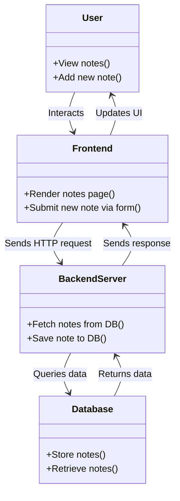

```mermaid
classDiagram
    User --> Frontend : Interacts
    Frontend --> BackendServer : Sends HTTP request
    BackendServer --> Database : Queries data
    Database --> BackendServer : Returns data
    BackendServer --> Frontend : Sends response
    Frontend --> User : Updates UI

    class User {
        +View notes()
        +Add new note()
    }

    class Frontend {
        +Render notes page()
        +Submit new note via form()
    }

    class BackendServer {
        +Fetch notes from DB()
        +Save note to DB()
    }

    class Database {
        +Store notes()
        +Retrieve notes()
    }
```
