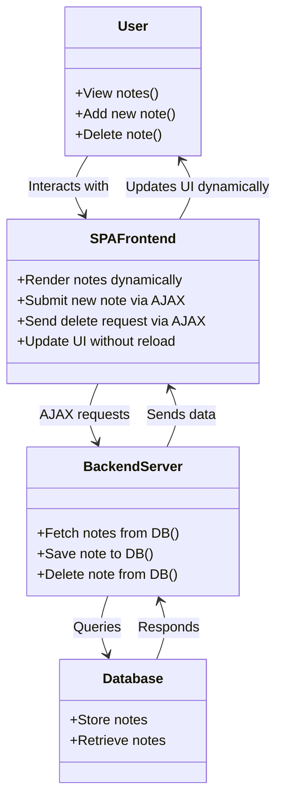

```mermaid
classDiagram
    class User {
        +View notes()
        +Add new note()
        +Delete note()
    }
    
    class SPAFrontend {
        +Render notes dynamically
        +Submit new note via AJAX
        +Send delete request via AJAX
        +Update UI without reload
    }
    
    class BackendServer {
        +Fetch notes from DB()
        +Save note to DB()
        +Delete note from DB()
    }
    
    class Database {
        +Store notes
        +Retrieve notes
    }

    User --> SPAFrontend: Interacts with
    SPAFrontend --> BackendServer: AJAX requests
    BackendServer --> Database: Queries
    Database --> BackendServer: Responds
    BackendServer --> SPAFrontend: Sends data
    SPAFrontend --> User: Updates UI dynamically
```
